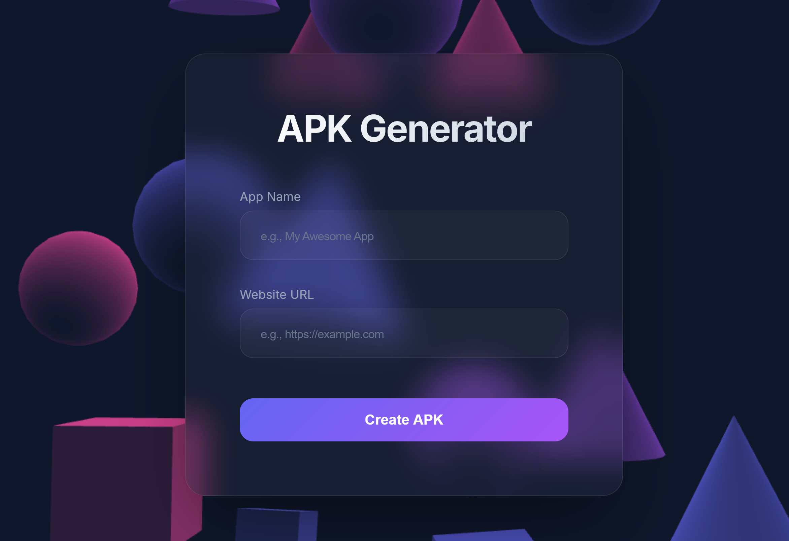
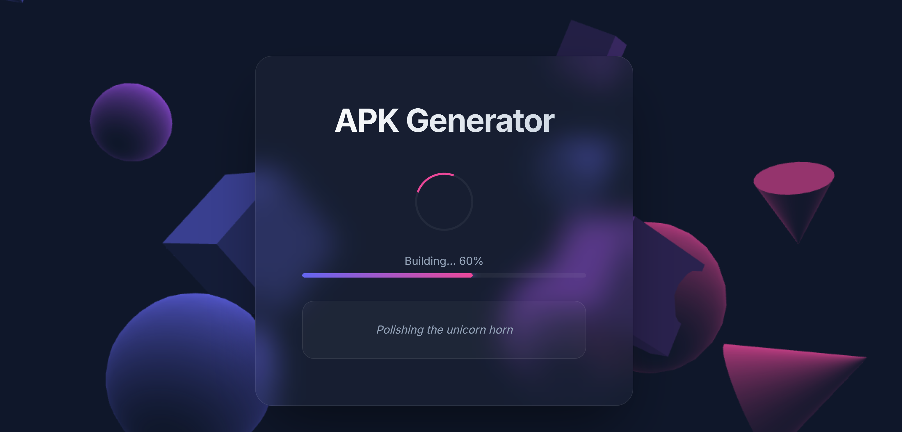
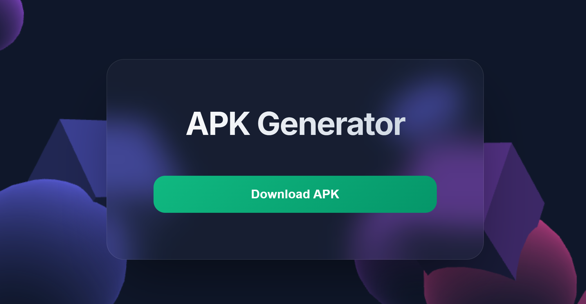

<div align="center">

# 🚀 Android-WebView-Auto-Builder
### Turn any URL into an APK in **< 1 second**. Zero Setup.


[](https://github.com/)
[](https://github.com/)
[](https://github.com/)
[](https://github.com/)
<br>
[](https://github.com/)
[](https://github.com/)
[](https://github.com/)
[](https://github.com/)

<p align="center">
  <b>No Android Studio. No Java installation required. No headaches.</b><br>
  Just run the script, and get your APK instantly.
</p>

</div>

<div align="center">
  
</div>

<div align="center">
  
</div>

<div align="center">
  
</div>

## 🚀 Live Website

> **Try it instantly:**  
> https://apk.weforks.org/

## ⚡ Why this exists?
Building a simple WebView app shouldn't require installing **20GB** of Android Studio. 
This tool automates the entire toolchain and uses **Binary Patching** to generate APKs instantly.

1.  **Downloads** portable Java & Android SDK (sandboxed).
2.  **Generates** a "Template" APK once.
3.  **Patches** the binary `AndroidManifest.xml` and `assets` in milliseconds.
4.  **Signs** the APK and delivers it.

---

## 🚀 Quick Start

### 1. Run the Server

#### 🪟 Windows (Python)
```powershell
python server.py
```

#### 🐧 Linux / 🍎 macOS (Python)
```bash
python3 server.py
```

#### 🐳 Docker (Recommended)
```bash
docker compose up --build -d
```
*Note: The first run will take a minute to download the SDK and build the template. Subsequent runs are instant.*

### 2. Build APK
Open **http://localhost:5001** in your browser.
1. Enter your **URL** (e.g., `https://google.com`).
2. Enter your **App Name** (e.g., `My App`).
3. Click **Build APK**.

Your APK will be ready in **~1 second**.

---

## 🛠️ Features
-   **⚡ Ultra Fast:** Uses **Binary Patching** to generate APKs in sub-second time.
-   **📦 Zero Dependencies:** Uses portable versions of OpenJDK and Command Line Tools.
-   **🛡️ Sandboxed:** All build tools are kept in `android_build_env` and removed after building.
-   **🔄 Smart Caching:** Downloads tools once. Subsequent builds are instant.
-   **🔒 Secure:** No admin rights required. No system environment variables changed.
-   **🌐 Web Dashboard:** Beautiful 3D interactive UI with **Glassmorphism**, micro-animations, and real-time progress tracking.
-   **👥 Multi-User Concurrency:** Supports multiple simultaneous builds with isolated environments.
-   **💾 Session Persistence:** Refreshing the page doesn't lose your build progress.

---
<details>


<summary>DEV Roadmap</summary>

- [x] v0.0.12 UI Polish & Stability Improvements
- [x] v0.0.11 Ultra Fast Builder - Binary Patching
- [x] v0.0.10 readme.md updated
- [x] v0.0.9 added to server apk.weforks.org
- [x] v0.0.8 screenshots added to README.md
- [x] v0.0.7 Implement APK Signing & Keystor management
- [x] v0.0.6 Web UI with 3D background & SessionPersistence
- [x] v0.0.5 Multi-user concurrency suppor
- [x] v0.0.4 Added Docker support for isolate builds
- [x] v0.0.3 Added Linux & macOS support (Bash sript)
- [x] v0.0.2 Implemented "Jokes Progress Bar"
- [x] v0.0.1 Initial Windows PowerShell automation

### Github Update
```bash
git add .
git commit -m "v0.0.12 UI Polish & Stability Improvements"
git push
```


</details>

---

<div align="center">
  <sub>Built with ❤️ for speed.</sub>
</div>
